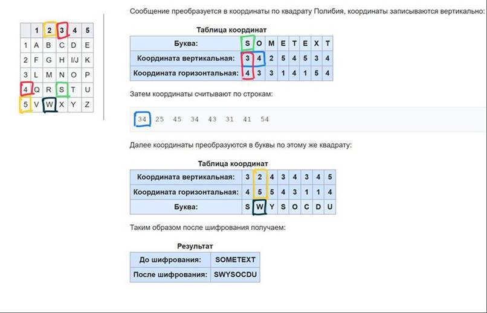

В криптографии существует класс шифров, называемых шифрами подстановки.
Одним из таких шифров является шифр Полибия, который использовался в древности.

Шифр основан на представлении алфавита текста, который должен быть зашифрован, в виде таблицы.
Каждому символу из таблицы ставятся в соответствие координаты, представляющие собой индексы строки и столбца, на пересечении которых находится символ.
Схема шифрования представлена на схеме ниже.

Задача: Реализовать алгоритм шифрования исходного текста для произвольной квадратной
таблицы кодирования (произвольный алфавит (символы могут быть любыми) произвольного размера (n*n)).

